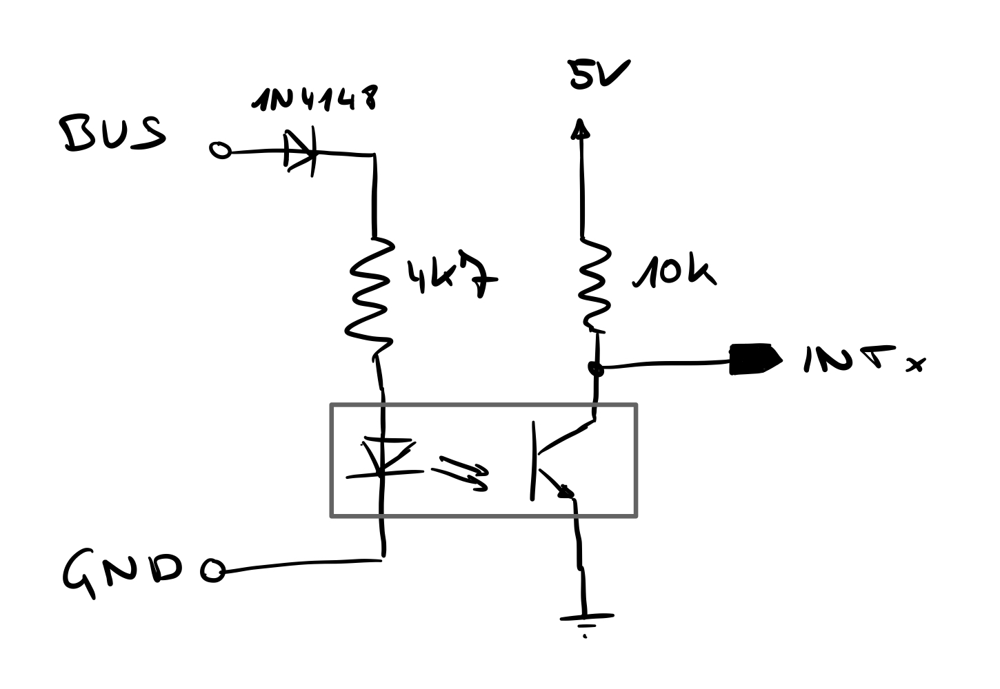

# ESR31_Web

A quick project to decode DL-Bus data of an ESR31 solar controller. The decoding is based on Elias Kuiter's project (https://github.com/ekuiter/uvr2web) and adds support for the ESR31 controller.

The bus signal is galvanically isolated by an optocoupler as illustrated below. Furthermore, the output signal is connected to an Arduino Nano to decode the Manchester encoding. Once the whole frame is gathered, the payload bytes are sent to a Raspberry Pi to be inserted into an influxDB.

